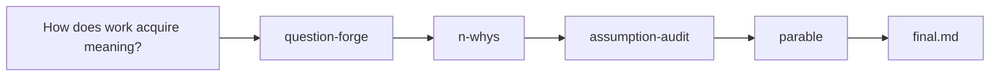
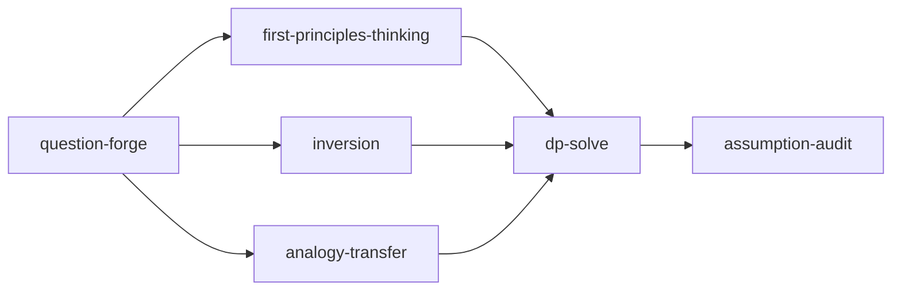

# semantic-algos

[](https://skills.sh/kousun12/semantic-algos)

> “As if Socrates, Dijkstra, Haskell, and GStack had a baby”
>
> — Rick Ruben

Stdlib of reasoning procedures to milk the humanities out of LLMs

Ordinary programs compose exact operations over data. These skills compose
interpretive operations over questions: trace causes, test premises, compare
options, reframe ideas, or give them literary form. Each procedure is
repeatable; its execution requires judgment. That is what we mean by a
**semantic algorithm**.

You can invoke a skill on its own, but the larger design is for modern agent
harnesses such as [Zo](https://www.zo.computer/), Codex, Claude Code, pi, and Cursor—any host that can launch
fresh subagents without inherited context. In those environments, `sem-run`
acts as a meta-program: it turns a request into an inspectable computation
graph, lets the harness orchestrate one subagent per semantic operation, and
returns the whole run as linked Markdown.

## Install

Install the full pack:

```bash
npx skills add kousun12/semantic-algos --skill '*'
```

This is the recommended installation for [`sem-run`](skills/sem-run): a Sem
program may call any skill in the repository's standard library, and the full
pack keeps those function contracts available to the compiler and runner.

Install one or more skills:

```bash
npx skills add kousun12/semantic-algos --skill dp-solve
npx skills add kousun12/semantic-algos --skill assumption-audit --skill decision-matrix
```

List the available skills without installing them:

```bash
npx skills add kousun12/semantic-algos --list
```

## Getting started

After installing the full pack, ask `sem-run` for the exploration you want in
ordinary language:

```text
$sem-run Let's explore how meaning becomes attached to work. Get to the bottom of it, test the deepest assumptions, then embody the tension in a short allegory.
```

You do not have to choose the operators. `sem-run` first compiles the
request into a readable Sem program. One valid compilation might have this
shape:



Each operator runs in a fresh subagent and leaves a standalone Markdown result
for the next one. The exact compilation may vary—the program is interpretable
prose, not parser input—but its application boundaries and dataflow remain
visible.

When the run finishes, `sem-run` reports a directory like:

```text
sem-runs/meaning-and-work/<timestamp>/
  program.md
  interpretation.md
  run.md
  applications/
    001-question-forge/
    002-n-whys/
    003-assumption-audit/
    004-parable/
  final.md
```

Open `final.md` for the returned allegory and a complete linked trace of how it
was produced. Because the state lives in files, a run can also be inspected or
resumed without relying on conversational memory.

## Use a single skill

Invoke a skill by name and give it a question. The best inputs often sound almost too simple to need a method:

```text
n-whys n=7 q=Why is the sky blue?
n-whys n=8 q=Why do we work?
assumption-audit q=Everything happens for a reason.
first-principles-thinking q=What makes a promise binding?
question-forge q=How do I know what I really want?
analogy-transfer q=How do you know when enough is enough?
nietzche-ladder q=What do children owe their parents?
explanation-ladder q=Why do people tell stories?
lyric q=Is missing someone a way of keeping them?
joke q=Why do meetings about productivity take so long?
```

The syntax is only a useful convention. Natural language works too: “Ask what a promise is from first principles.”

The same procedure can cross domains because its control structure is semantic rather than numerical. For example, one honest route through `n-whys n=7 q=Why is the sky blue?` is:

1. The sky looks blue because air molecules scatter the shorter visible wavelengths of sunlight more strongly than the longer ones.
2. That bias comes from Rayleigh scattering, whose strength rises sharply as wavelength falls.
3. Rayleigh's rule applies because the molecules are much smaller than the wavelengths of visible light; the light's electric field turns them into tiny reradiators.
4. There is blue light available to scatter because the hot Sun emits a broad spectrum rather than a single wavelength.
5. We see blue rather than violet because the solar spectrum, atmospheric absorption, and human visual sensitivity weight the scattered wavelengths differently.
6. Visual sensitivity matters because a perceived hue comes from the relative responses of several kinds of cone cell, not from a wavelength carrying a color name.
7. “Blue” is therefore neither simply painted onto the sky nor invented inside the head; it arises when a brain interprets the encounter among light, air, and eyes.

The question begins in atmospheric physics and ends at the philosophy of perception. A different chain might branch elsewhere; the skill's job is to make every step visible enough to challenge.

Run the same operator on `Why do we work?` and the route might pass through food and shelter, coordination, surplus, status, identity, recognition, and the wish to matter. The shift between biological, historical, and motivational explanations is part of the answer; a good why-chain names it rather than pretending the question has a single root.

Other prompts reveal different characteristic shapes:

| Prompt | Where the procedure can take it |
| --- | --- |
| `assumption-audit` on “Everything happens for a reason” | Separates causes from purposes, explanations from consolations, and a belief's usefulness from its truth. |
| `first-principles-thinking` on a promise | Removes custom, reputation, and punishment to ask what remains: consent, reliance, and continuity with the person who gave their word. |
| `question-forge` on “What do I really want?” | Distinguishes appetite, imitation, recognition, and obligation, then returns the question whose answer would actually cost something. |
| `analogy-transfer` on knowing when enough is enough | Looks for stopping rules in foraging, medicine, art, games, and search, then asks which ones survive contact with a human life. |
| `nietzche-ladder` on what children owe their parents | Moves from inherited duty, through refusal of the debt, toward an obligation that could be chosen freely. |
| `explanation-ladder` on why people tell stories | Climbs from entertainment and memory through social rehearsal and identity to the need to make a life intelligible. |
| `ladder-of-abstraction` on *If You Give a Mouse a Cookie* | Moves from a comic chain of requests, to a circular narrative, to feedback loops in desire and care. |
| `lyric` on whether missing someone keeps them near | Gives the contradiction a speaker, an addressee, an image field, and a phrase whose meaning changes each time it returns. |
| `joke` on meetings about productivity | Finds the contradiction, plants its respectable interpretation, then springs its less flattering interpretation as a punchline. |

Choose a procedure that matches the shape of the question. A weighted matrix is useful when the options are known. It is useless while the options themselves remain unknown. A why-chain can expose a cause, but it can also invent one if the links are treated as facts. Each skill includes its own dispatch rules, failure modes, output form, and canonical questions.

## The standard library

The semantic skills under `skills/*` are Sem's standard library. Each skill's
`SKILL.md` is its function contract: it defines when the operator fits, the
procedure it follows, its output form, stopping rule, and guardrails. The two
language tools, [`sem-compile`](skills/sem-compile) and
[`sem-run`](skills/sem-run), live in the same collection but orchestrate the
library rather than acting as ordinary semantic functions inside a program.

### Causes and premises

| Skill | Operation |
| --- | --- |
| [`five-whys`](skills/five-whys) | Follow a symptom toward root causes. The practical preset of `n-whys`. |
| [`n-whys`](skills/n-whys) | Follow a causal, conceptual, motivational, or philosophical chain to an explicit depth. |
| [`first-principles-thinking`](skills/first-principles-thinking) | Separate real constraints from inherited defaults, then rebuild from the remaining primitives. |
| [`assumption-audit`](skills/assumption-audit) | Extract load-bearing assumptions, grade the evidence, and identify the cheapest decisive tests. |

### Problems and decisions

| Skill | Operation |
| --- | --- |
| [`dp-solve`](skills/dp-solve) | Build a graph of overlapping subproblems, answer each once, and synthesize from the memo table. |
| [`decision-matrix`](skills/decision-matrix) | Score named options against weighted criteria, then test whether the result survives changes in the weights. |
| [`inversion`](skills/inversion) | Enumerate the ways to guarantee failure, rank them, and convert the strongest failure modes into guards. |
| [`counterfactual`](skills/counterfactual) | Change one fact, propagate the consequences, and judge whether the outcome was contingent or overdetermined. |

### Reframing

| Skill | Operation |
| --- | --- |
| [`ladder-of-abstraction`](skills/ladder-of-abstraction) | Move between concrete cases, middle-level patterns, and governing principles. |
| [`analogy-transfer`](skills/analogy-transfer) | Find the same structure in distant fields, import their mechanisms, and check where the analogy breaks. |
| [`question-forge`](skills/question-forge) | Diagnose a loaded or misplaced question and formulate the question worth carrying. It does not answer it. |

### Explanation and form

| Skill | Operation |
| --- | --- |
| [`explanation-ladder`](skills/explanation-ladder) | Explain a topic through five successive voices, each correcting and deepening the last. |
| [`nietzche-ladder`](skills/nietzche-ladder) | Pass a topic through Nietzsche's Camel, Lion, and Child: inheritance, refusal, and creation. |
| [`golden-circle`](skills/golden-circle) | Separate purpose, method, and output, then check whether Why, How, and What agree. |
| [`parable`](skills/parable) | Compile a question into a short story that embodies the tension without stating or settling it. |
| [`lyric`](skills/lyric) | Compile a question into a poem or song whose voice, images, sound, and recurrence embody the tension. |
| [`joke`](skills/joke) | Compile a topic into a setup and punchline that switch between two compatible frames. |

## Language tooling

| Skill | Operation |
| --- | --- |
| [`sem-compile`](skills/sem-compile) | Compile natural language, a loose pipeline, or an existing `program.md` into a readable Sem program and compile notes, without running or answering it. |
| [`sem-run`](skills/sem-run) | Compile when needed, interpret the program, run every semantic application in a fresh subagent, and return a linked Markdown trace. |

For compile-only work, invoke the compiler directly:

```text
$sem-compile Find the real question in why I keep volunteering for work I resent, then express a route from that question to a parable.
```

`sem-compile` writes `request.md`, `program.md`, and `compile-notes.md` under a
collision-safe `sem-programs/<title>/<timestamp>/` bundle and stops. It does
not execute the program or answer the request.

## Composition

Each skill is an operator. Chained together, they become small semantic programs for curiosity, interpretation, decisions, and ordinary life.

The Haskell-esque programs below are executable Sem conventions: pass one to
`sem-run` as a rough sketch or save it as `program.md`. Camel-cased names such
as `questionForge` resolve to installed skills such as `question-forge`.
Punctuation, indentation, type-like hints, and combinators help a language
model recover the applications and dataflow; they do not need to be valid
Haskell or conform to a fixed grammar.

```haskell
work =
  nWhys `with` { depth = 8, question = "Why do we work?" }
  >>> assumptionAudit `with` { focus = deepestClaim }

desire =
  questionForge "How do I know what I really want?"
  >>> nWhys `with` { depth = 7 }

promise =
  firstPrinciplesThinking "What makes a promise binding?"
  >>> inversion `with` { focus = candidateRule }

mouse =
  ladderOfAbstraction "If You Give a Mouse a Cookie"
  >>> analogyTransfer `with` { focus = repeatingStructure }

karamazov =
  dpSolve "What is The Brothers Karamazov about?"
  >>> questionForge `with` { focus = mostReusedTension }
  >>> parable

missing =
  questionForge "Is missing someone a way of keeping them?"
  >>> lyric

meetings =
  assumptionAudit "Meetings make us more aligned"
  >>> joke
```

The notation stays deliberately rough and readable:

```haskell
f >>> g                 -- sequence: pass f's result to g
f &&& g                 -- fan out: run both on the same input
f <|> g                 -- choose or fall back between routes
f `with` { option = x } -- configure an operator
map f                   -- apply f to every result
repeat n f              -- iterate or deepen an operator
```

Sem programs may define local shims such as `extractTension` or invent a
one-off construct when the standard library does not contain the right move.
The program must gloss the construct well enough to recover its inputs,
semantic applications, output, stopping behavior, and guardrails. Local
constructs belong to that program; using one does not silently add a new skill
to the standard library.

`sem-run` gives every semantic application its own fresh, no-history subagent
and records every successful result as a standalone artifact. That includes
standard-library calls, local operators, fan-out branches, mapped items,
iteration predicates, selectors, and semantic synthesis. Naming a value or
ordering already-produced results is structural and does not create another
application. Fresh context is an application-level isolation boundary, not a
claim of OS-level filesystem sandboxing.

The entire run is recorded as Markdown so it can be inspected or resumed from
files alone. A representative layout is:

```text
sem-runs/<title>/<timestamp>/
  request.md
  compiler-prompt.md
  program.md
  compile-notes.md
  interpretation.md
  run.md
  inputs/
  applications/
    001-question-forge/
      prompt.md
      result.md
      status.md
    002-extract-tension/
      prompt.md
      result.md
      status.md
  finalizer-prompt.md
  final.md
```

Each application has its own prompt and status; each successful application
also has a standalone result. `final.md` presents or links the returned
artifacts in the program's declared order, describes what actually ran,
reports partial or blocked work, and links every other Markdown artifact in
the trace.

Sem has no parser, type checker, generated code, or checked-in executable
runtime. The compiler clarifies prose into more explicit prose; the runner
interprets it and delegates semantic work. Different valid compilations and
runs may vary, but each must make its intent, application boundaries, dataflow,
and return order recoverable.

For example, a program can branch into several interpretations and bring them back together:

```haskell
deepAnalysis =
  questionForge
  >>> (firstPrinciplesThinking &&& inversion &&& analogyTransfer)
  >>> dpSolve `with` { objective = "synthesize the branch results" }
  >>> assumptionAudit
```

That program is a graph, not just a list. The three middle applications can run
in parallel once `question-forge` succeeds; `dp-solve` waits for all three
results before synthesizing them:



Haskell readers may recognize that these effectful, context-carrying steps are closer to Kleisli composition (`>=>`) than pure function composition (`.`). The public notation uses `>>>` because the left-to-right flow is easier to read.

The work program can reach the claim that work gives life meaning, then audit whose work counts and whether the claim survives examples of care, art, play, and idleness. The desire program forges a vague question into one with stakes, then follows it through appetite, imitation, recognition, freedom, and mortality. The promise program rebuilds obligation from its primitives, then tries to construct a rule that would reliably turn promises into traps or excuses.

The mouse's chain becomes a model of self-renewing desire and is tested against distant examples. The Karamazov program memoizes the questions shared by different characters and episodes, forges the one doing the most explanatory work, and returns a new story instead of an essay about the old one. The missing-someone program sharpens its contradiction, gives it to a particular speaker, and lets a repeated phrase change meaning instead of supplying an answer. The meetings program finds the hidden premise beneath institutional language, leads the audience into its respectable meaning, and then drops it through a second frame.

Composition also adds choices that a single skill does not have: which intermediate results remain visible, when to branch, when to iterate, and what form the final result should take. A compound program may run a table internally and return a letter, a dissent, a parable, a lyric, a joke, or a post-mortem instead of the table.

## User-space programs

The standard library supplies the operators. The following user-space programs
are Sem compositions that can be run from inline text or a `program.md`. They
show the larger space of possible semantic programs, but this repository does
not install them as named functions.

### Hidden intermediates and literary forms

| Program | Composition |
| --- | --- |
| **omelas** | Silently run `question-forge`, pass the result to `parable`, and reveal only the story. The reader must recover the question. |
| **court-jester** | Audit a plan, turn its most load-bearing contradiction into a joke, and let the punchline carry the dissent. |
| **sliding-doors** | Propagate both branches of a decision ten years forward and return two letters from the possible future selves. Withhold the recommendation. |
| **oracle** | Run a decision matrix, cast the options as inhabitants of a parable, and hide the scores. The reader's allegiance becomes the gut check. |
| **cassandra** | Invert a plan, propagate its strongest failure mode, and write the result as a dated post-mortem from the future. |
| **obituary** | Combine a world-without-X counterfactual with the Camel/Lion/Child sequence, then write X's eulogy. |
| **borges** | Review an imaginary book, product, or movement from five years after its success, including its consequences and failed imitators. |
| **chorus** | Attach a voice to a plan in motion that may name what everyone sees but may not recommend or intervene. |
| **scheherazade** | End each research session with the single live question generated by the work, preserving it for the next session rather than closing it. |

### Iteration, branching, and routing

| Program | Composition |
| --- | --- |
| **rabbit-hole** | Alternate `question-forge` and `n-whys` until the formulation stops changing; return only the fixed-point question. |
| **heist** | Run `dp-solve`, apply `analogy-transfer` to low-confidence subproblems, place the imported mechanisms in the memo table, and resynthesize. |
| **chesterton** | Trace why a convention exists, reduce it to first principles, then defend it if the constraint remains or remove it if the constraint has expired. |
| **triage** | Inspect the shape of a question and route it to direct answering, causal analysis, option comparison, assumption testing, or question formulation. |

### Disagreement and institutional memory

| Program | Composition |
| --- | --- |
| **peace-talks** | Run the same decision matrix with each party's weights and return the smallest set of weight differences that explains the dispute. |
| **turing-mirror** | Reconstruct an opponent's Why/How/What until they would accept it, then audit your own position using their strongest premise. |
| **dissent** | After a decision, preserve the strongest losing opinion as a document addressed to the future people who will live with the result. |
| **devils-advocate** | Before canonizing a hire, strategy, or belief, appoint a bounded adversarial role to prosecute every supporting claim. |
| **truth-and-reconciliation** | Collect a blame-free account under amnesty, close that phase, and only then run causal analysis on the shared record. |
| **federalist** | Derive one conclusion independently from economic, moral, and operational premises; inspect where the arguments converge. |
| **rashomon** | Narrate one disputed event from every participant's self-consistent viewpoint; separate the invariant facts from the interest-bearing differences. |

### Philosophical operators

| Program | Composition |
| --- | --- |
| **aporia** | Forge successive questions around a confident definition until two sincere commitments contradict each other; return the contradiction without resolving it. |
| **veil** | Remove knowledge of the role the chooser will occupy, evaluate a policy from every possible position, then reveal the choice made under ignorance. |
| **via-negativa** | Define a difficult subject through informative exclusions, leaving the positive space unstated but sharply bounded. |
| **genealogy** | Trace a value backward through the historical contests that made it appear natural, asking who gained when each formulation prevailed. |
| **epoché** | Bracket interpretations, describe only what was observed, then readmit each interpretation with the assumptions it adds. |

These programs borrow more than names. A useful historical form carries a procedure: Rawls removes the chooser's identity; Socratic inquiry terminates in contradiction; judicial dissent stores a losing argument for another time; *Rashomon* distributes one event across interested narrators. The procedure is the transferable part.

## Anatomy of a semantic algorithm

A skill in this pack should have:

1. a recognizable input condition;
2. a control structure that changes the reasoning;
3. ordered operations an agent can execute;
4. a stable output form;
5. an explicit stopping rule;
6. guardrails for the method's characteristic errors;
7. canonical questions and clear poor fits.

The test is behavioral. If removing the procedure would not change the answer's structure, the skill is only a writing prompt.

## Naming note

The package retains the original skill slug `nietzche-ladder`; prose uses the standard spelling, Nietzsche.

## License

MIT

[](https://www.skills.sh/kousun12/semantic-algos)

[Agent Skills specification](https://agentskills.io/specification)
